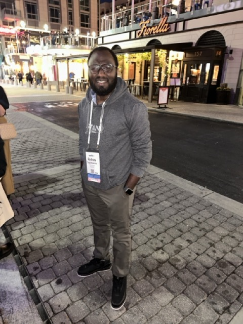

<link rel="stylesheet" href="https://cdn.jsdelivr.net/gh/jpswalsh/academicons@1/css/academicons.min.css">

[<i class="fa-solid fa-envelope fa-2x"></i>](mailto:etb68@missouri.edu) 
[<i class="ai ai-google-scholar-square ai-2x"></i>](https://scholar.google.com/citations?user=PE1bl_4AAAAJ&hl=en) 
[<i class="fa-brands fa-researchgate fa-2x"></i>](https://www.researchgate.net/profile/Esdras-Tuyishimire)
[<i class="ai ai-orcid-square ai-2x"></i>](https://orcid.org/0009-0004-7608-4076) 
[<i class="fa-brands fa-square-github fa-2x"></i>](https://github.com/etb68)
[<i class="fa-brands fa-linkedin fa-2x"></i>](https://linkedin.com/in/etuyishimire/)
[<i class="fa-brands fa-x-twitter fa-2x"></i>](https://x.com/TuEsdras)

::: {layout-ncol=2}
I am a PhD candidate at [MU Division of Biological Sciences](https://biology.missouri.edu/). I have skills in quantitative & population genetics, statistical modeling, and machine learning for biological datasets. My current projects focus on building evolutionary simulation models and validating them through empirical studies, where I explore the effects of fluctuating environmental conditions on evolutionary dynamics. Prior to joining my PhD, I complete masters degree from [MU Division of Animal Sciences; Decker Computational Genomics](https://deckerje.mufaculty.umsystem.edu/people), where my project focused on identifying genomic markers associated with heifer fertility.

{fig-alt="Photo of Esdras attending conference."}
:::

::: {layout-ncol=1}
## Publications

[Google Scholar](https://scholar.google.com/citations?user=PE1bl_4AAAAJ&hl=en)

[ResearchGate](https://www.researchgate.net/profile/Esdras-Tuyishimire)

:::
