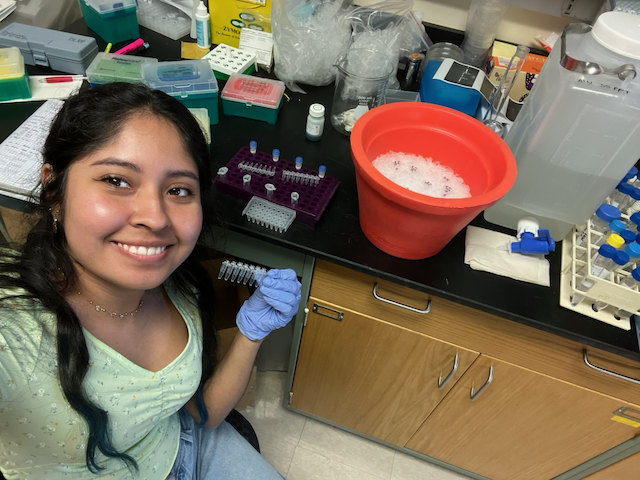

<link rel="stylesheet" href="https://cdn.jsdelivr.net/gh/jpswalsh/academicons@1/css/academicons.min.css">

# About me!

[<i class="fa-solid fa-envelope fa-2x"></i>](mailto:eb8tz@umsystem.edu)
[<i class="fa-brands fa-square-github fa-2x"></i>](https://github.com/ellbaca)

::: {layout-ncol=2}

I am a Ph.D. student in the Division of Biological Sciences at Mizzou. [MU Division of Biological Sciences](https://biology.missouri.edu/). I am originally from Miami, FL where I did my undergrad in [Florida International University](https://case.fiu.edu/biology/students/undergraduate-programs/bs-in-biological-sciences/). I was introduced to the King lab through the [Post-baccalaureate Research Education Program (PREP)](https://prepscholars.missouri.edu/) in 2023. Afterwards, I received my Masters Degree in the King Lab in 2025 where I studied gene expression changes in populations adapted to different diet regimes. Some of my hobbies include crocheting, reading, trying out new restaurants in town, and hanging out with Mary!

{fig-alt="Photo of girl in laboratory."}

:::

# Research Projects

My work focuses on phenotypic changes caused by adaptation to different temperatures.

I am also looking into dietary proteins role in reproductive success under differing temperatures.

