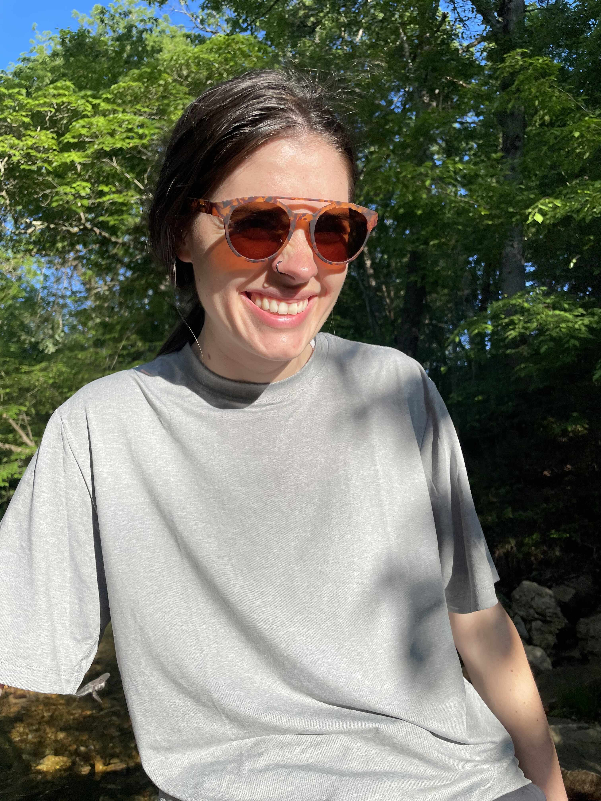

<link rel="stylesheet" href="https://cdn.jsdelivr.net/gh/jpswalsh/academicons@1/css/academicons.min.css">

## Mary A. York (she/her)

[<i class="fa-solid fa-envelope fa-2x"></i>](mailto:myork@missouri.edu) [<i class="ai ai-orcid-square ai-2x"></i>](https://orcid.org/0009-0004-6428-3481) [<i class="fa-brands fa-github fa-2x"></i>](https://github.com/may96cc)

::: {layout-ncol=2}

::: {.column}
I am a PhD student in the [MU Institute for Data Science and Informatics (MUIDSI)](https://muidsi.missouri.edu/) and a data scientist at the [MU Genomics Technology Core](https://mugenomicscore.missouri.edu/). My research interests include computational genomics, deep learning, engineering data pipelines that (usually) don't break at 2am, and making computers do the tedious parts of biology.

When I'm not wrangling data or debugging code, I enjoy backpacking, trying new crafts, hanging with my dog, and drinking lots of coffee.
:::

::: {.column}
{fig-alt="Photo of Mary in sunglasses."}
:::

:::
