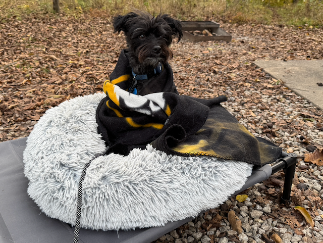

<link rel="stylesheet" href="https://cdn.jsdelivr.net/gh/jpswalsh/academicons@1/css/academicons.min.css">

## Reni King-Middleton (she/her)

[<i class="fa-solid fa-envelope fa-2x"></i>](mailto:middletonk@missouri.edu) [<i class="ai ai-google-scholar-square ai-2x"></i>](https://scholar.google.com/citations?user=Ziha7x8AAAAJ) [<i class="ai ai-orcid-square ai-2x"></i>](https://orcid.org/0000-0003-4704-1064) [<i class="ai ai-pubmed-square ai-2x"></i>](https://www.ncbi.nlm.nih.gov/myncbi/kevin.middleton.1/bibliography/public/) [<i class="fa-brands fa-square-github fa-2x"></i>](https://github.com/Middleton-Lab) [<i class="fa-brands fa-github-alt fa-2x"></i>](https://github.com/kmiddleton) [<i class="ai ai-osf-square ai-2x"></i>](https://osf.io/fbh2k/)

::: {layout-ncol=2}

I am a resident dog in the [MU Division of Biological Sciences](https://biology.missouri.edu/). My interests include meats, cheeses, and high-volume barking.

{fig-alt="Photo of a dog wrapped in a blanket."}

:::

I was born on a farm in Moberly with two brothers. We all found new families via [Petfinder](https://www.petfinder.com/). 

### Research Projects

My work focuses on montitoring the local environment for new smells. I perform daily sampling. 

Important: images must be small! Less than 1MB please!