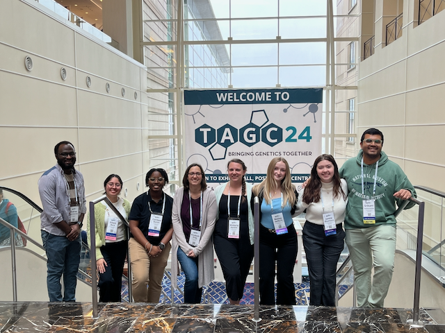

{fig-alt="Photo of a group of people at a scientific conference."}

Research in the King Lab addresses fundamental questions in evolutionary genomics, seeking to understand how genomes change when phenotypes evolve. We integrate computational methods with large-scale empirical studies, with a primary focus on understanding the evolution of complex traits.

Our lab is in the [Division of Biological Sciences](https://biology.missouri.edu/) at the [University of Missouri](https://missouri.edu/).

