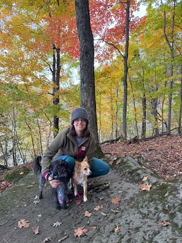
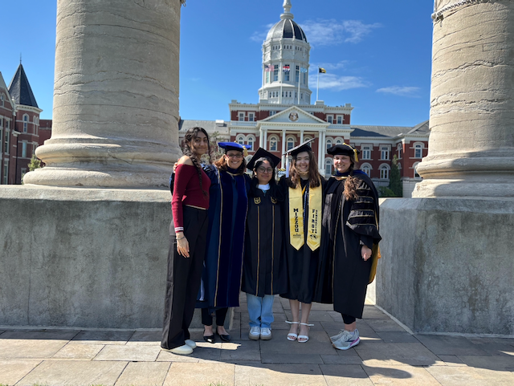
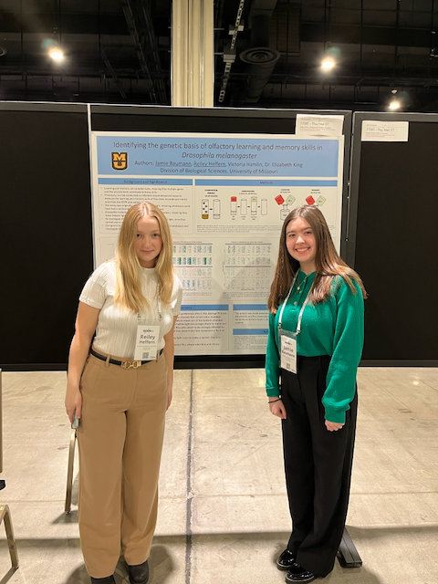

<link rel="stylesheet" href="https://cdn.jsdelivr.net/gh/jpswalsh/academicons@1/css/academicons.min.css">

## Elizabeth (Libby) King (she/her)

[<i class="fa-solid fa-envelope fa-2x"></i>](mailto:kingeg@missouri.edu) [<i class="ai ai-google-scholar-square ai-2x"></i>](https://scholar.google.com/citations?user=GbE4S4gAAAAJ) [<i class="ai ai-orcid-square ai-2x"></i>](https://orcid.org/0000-0002-9393-4720) [<i class="ai ai-pubmed-square ai-2x"></i>](https://www.ncbi.nlm.nih.gov/myncbi/18Ud7XOcULGQL/bibliography/public/) [<i class="fa-brands fa-square-github fa-2x"></i>](https://github.com/EGKingLab) [<i class="fa-brands fa-github-alt fa-2x"></i>](https://github.com/egking) 

::: {layout-ncol=2}

I am an Associate Professor in the [MU Division of Biological Sciences](https://biology.missouri.edu/). Before joining the faculty at Mizzou in 2014, I was a postdoctoral scholar in [Tony Long's lab](https://wfitch.bio.uci.edu/~tdlong/sandvox/) at [UC Irvine](https://ecoevo.bio.uci.edu/) where I first started working on the [DSPR](https://wfitch.bio.uci.edu/~dspr/). Further back in time, I was an undergraduate at [Grinnell College](https://www.grinnell.edu/) and then a PhD student working on wing dimorphic insects with Daphne Fairbairn and Derek Roff at [UC Riverside](https://www.ucr.edu/).

{height=200px fig-alt="Photo of Dr. King with two dogs."}

:::

## Lab Members 

:::{.callout-note icon=false}

## Learn about our team

**Click on each lab member's name below to learn more about them!**
Interested in joining the team? Send me an email [<i class="fa-solid fa-envelope fa-1x"></i>](mailto:kingeg@missouri.edu).

:::

::: {layout-ncol=2}

::: {.column}

#### Lab Manager

-   Cameron Trowbridge

#### Postdoctoral Scholars

-  Srikant Ventkitachalam

#### Graduate Students

-  [Elliett Baca](Team/ejb.html)
-  [Esdras Tuyishimire](Team/Esdras.html)
-  [Mary York](Team/myork.html)
:::

::: {.column}

{fig-alt="Photo of a group of graduates."}

:::
:::
::: {layout-ncol=2}
::: {.column}
#### Undergraduate Researchers

- Payton Barlow
- Alaina Franke
- Diamond Francois
- [Reiley Heffern](Team/reiley.html)
- Jake Wilson

:::

::: {.column}

{fig-alt="Photo of two students in front of a scientific poster."}

:::

:::

