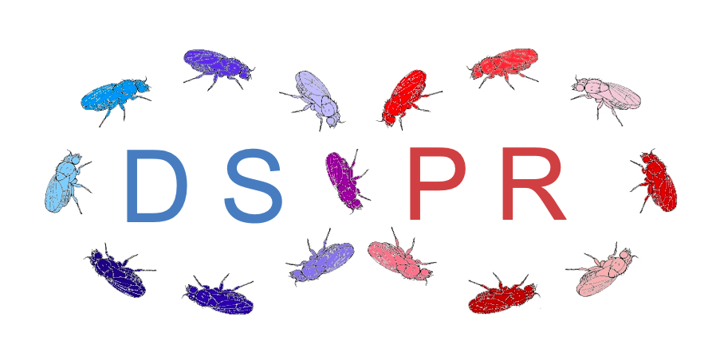
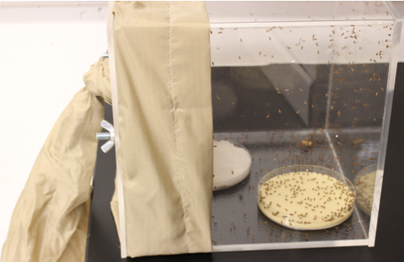

## Development of multiparent population resources

::: {layout-ncol=2}

::: {.column}

{fig-alt="Photo of 15 fruit flies arranged in an infinity symbol. Each fly is a different color. The letters DSPR appear within each loop."}

:::

::: {.column}

Our lab is part of a collaborative project to develop a community resource for the genetic dissection of complex traits in *Drosophila melanogaster*. The [Drosophila Synthetic Population Resource (DSPR)](http://FlyRILs.org) is a [multiparental population (MPP)](https://www.genetics.org/content/multiparental_populations) consisting of a large collection of recombinant inbred lines derived from an 8-way 50 generation intercross. 

:::

:::

This design creates a panel of lines whose genomes are a mosaic of the original 8 founder lines, allowing for unprecedented mapping resolution for a linkage-based panel. In addition to using these lines in our research, we also work on describing the genetic properties of the resource and developing analytical tools and methodologies to enable other users. We have also developed and maintain the [DSPRqtl R package](http://wfitch.bio.uci.edu/~dspr/Tools/Tutorial/index.html) to aid QTL mapping analyses with these lines. 

## Experimental Evolution

::: {layout-ncol=2}

::: {.column}

{fig-alt="Photo of a plexiglass cage holding fruit flies."}

:::

::: {.column}

Our lab regularly employs an experimental evolution approach using fruit fly populations. As our fly populations adapt to different treatements, we characterize changes across the genotype to phenotype map, providing an integrated, unprecedented look at microevolution in action. You can see an example of this evolution happening by looping the video below, which shows how haplotype frequencies change across one chromosome arm in one selection line over several generations. 

:::

:::

 
